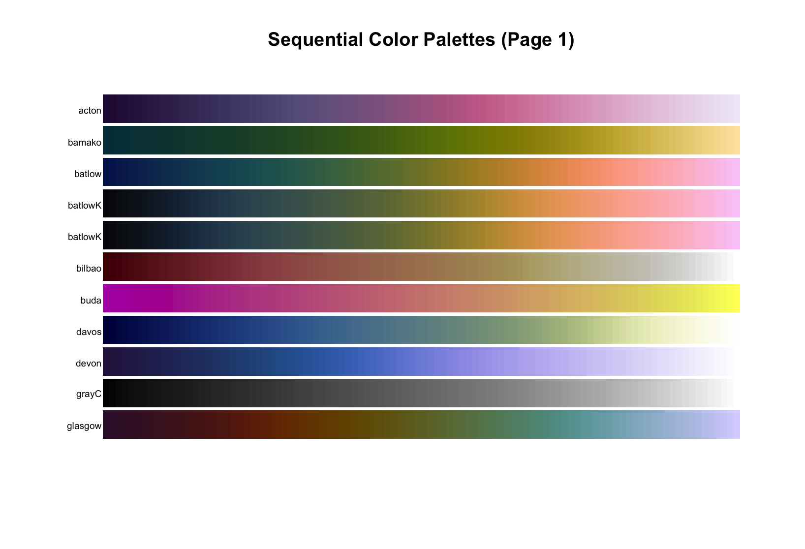
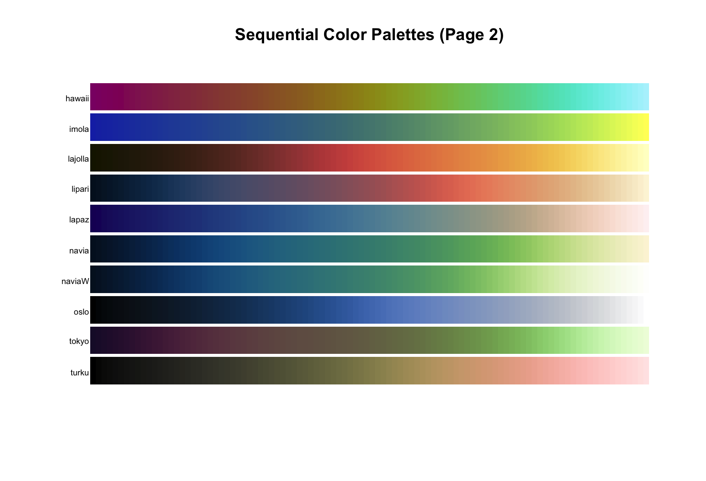
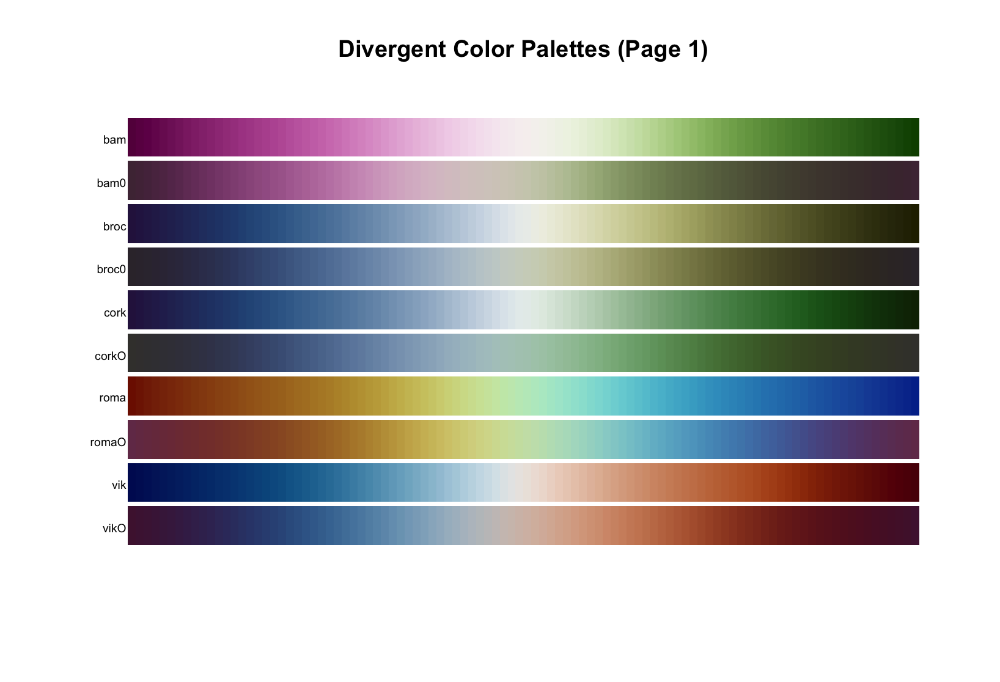
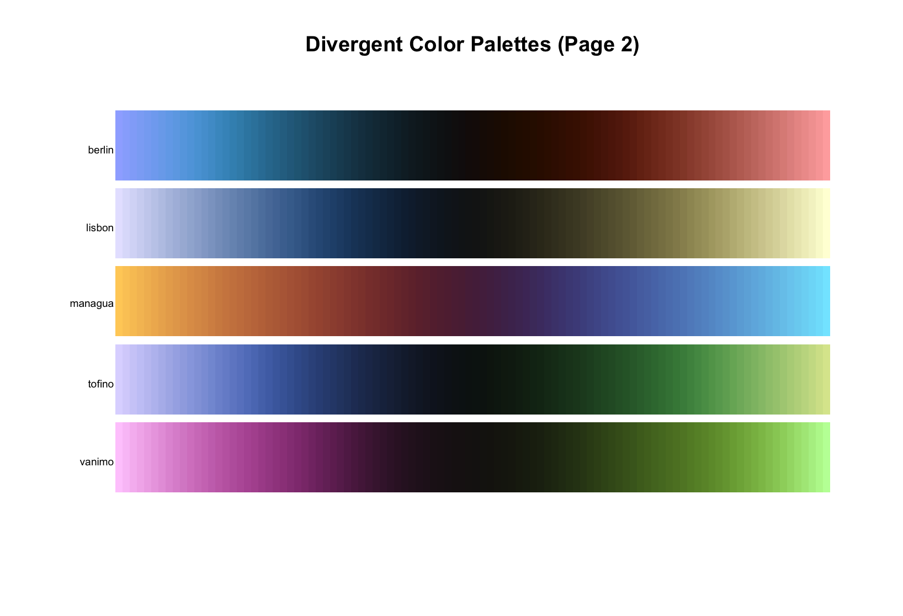
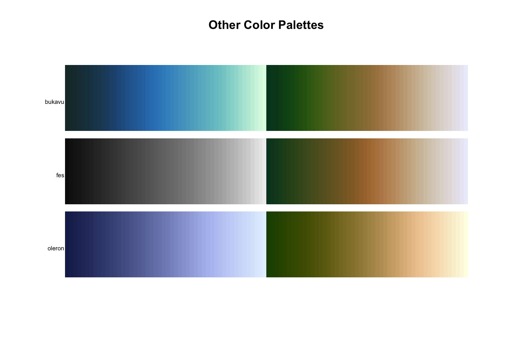

# batlow
This is an easy to use wrapper package for the wonderful, scientifically accurate color palettes curated by Fabio Crameri and others (see references). This package seeks to make these color palettes available to the R community outside of ggplot2 (see the [scico](https://github.com/thomasp85/scico) package for ggplot2 compatible implementation) in a manner consistent with the excellent _pals_ package [link](https://cran.r-project.org/web/packages/pals/index.html).

### Quick Start

Install the package from GitHub with `remotes`, then either attach it with `library(batlow)` or call palette functions with the `batlow::` prefix.

```r
install.packages("remotes")
remotes::install_github("tbrycekelly/batlow")
```

To retrieve colors after attaching the package:
```r
library(batlow)

batlow(16)
lisbon(8)
vik(128)
```

If you prefer not to attach the package, use explicit namespace calls:
```r
batlow::batlow(16)
batlow::lisbon(8)
batlow::vik(128)
```

### About

This package is maintained by Thomas Kelly, who developed `batlow` to make Fabio Crameri's scientific color palettes easy to use in base R workflows and other non-`ggplot2` contexts.

Icy Seas Co-Laboratory LLC supports practical, reproducible scientific computing and data analysis tools, and `batlow` is part of that broader commitment to accessible research software.

See the palette offerings below:







---
### References
- https://www.fabiocrameri.ch/
