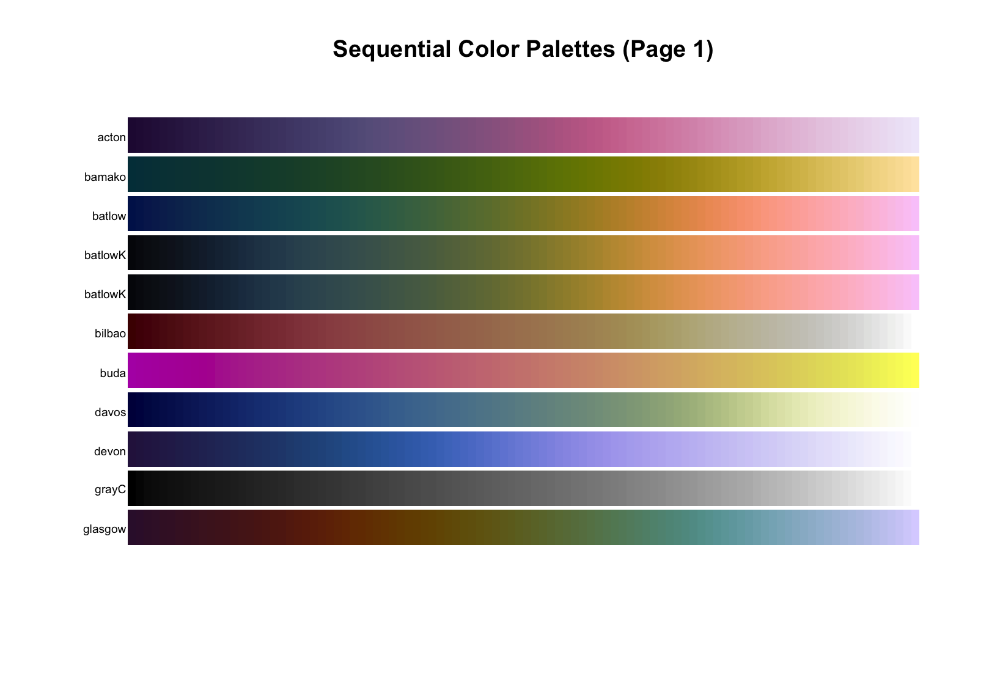
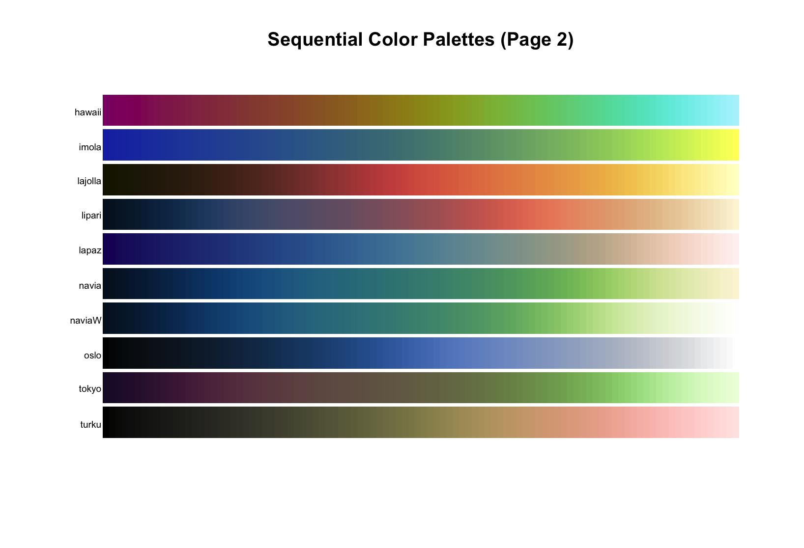
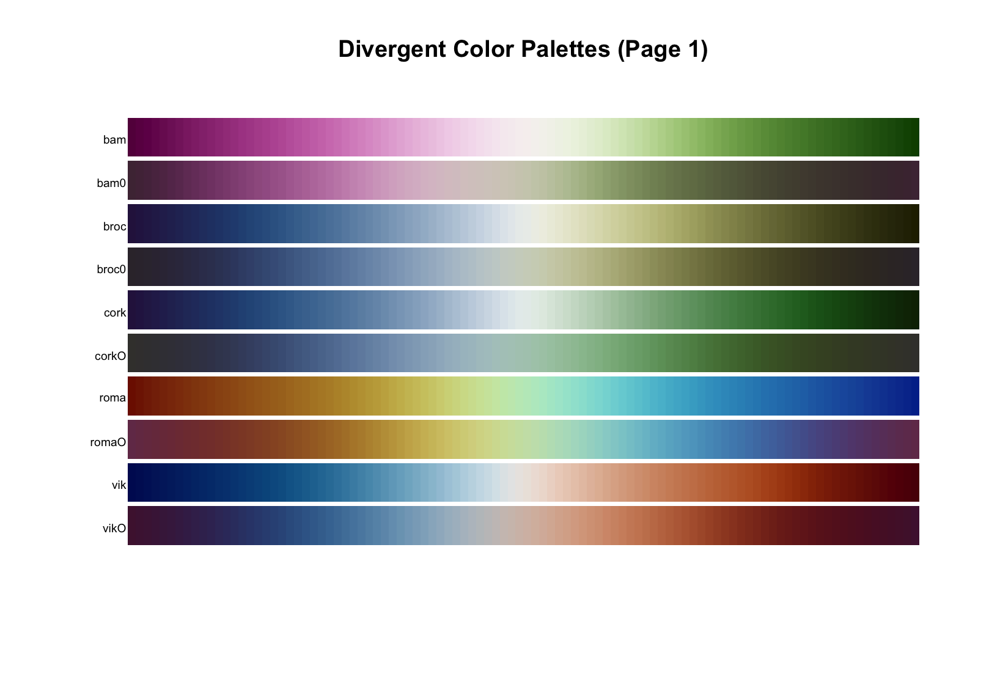
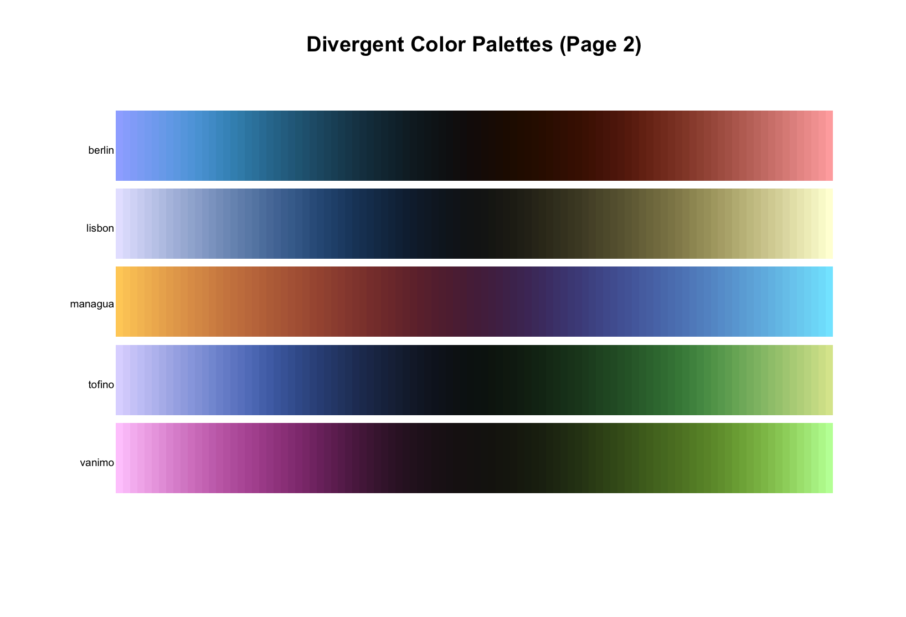
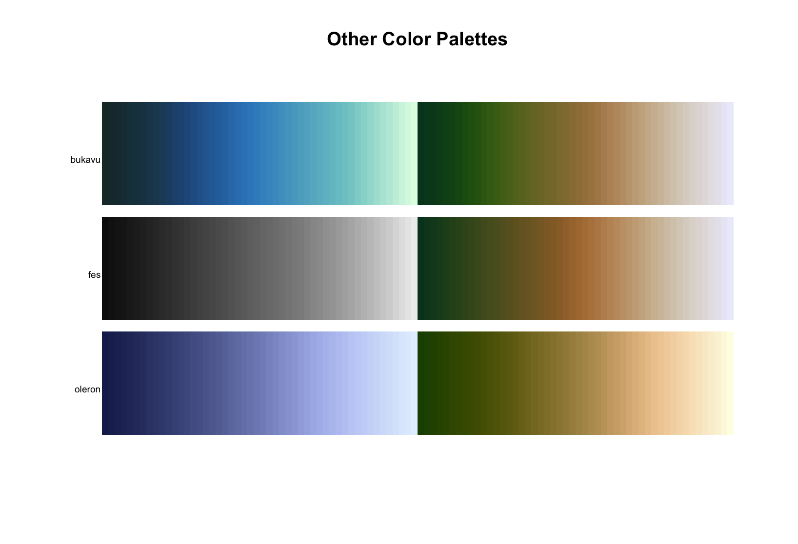

# batlow
This is an easy to use wrapper package for the wonderful, scientifically accurate color palettes curated by Fabio Crameri and others (see references). This package seeks to make these color palettes available to the R community outside of ggplot2 (see the [scico](https://github.com/thomasp85/scico) package for ggplot2 compatible implementation) in a manner consistent with the excellent _pals_ package [link](https://cran.r-project.org/web/packages/pals/index.html).

### Quick Start

If you already have `devtools` package installed, then just run the following otherwise install it with `install.packages(devtools)`.

```r
devtools::install_github('tbrycekelly/batlow)
```

See the palette offerings below:







---
### References
- https://www.fabiocrameri.ch/
